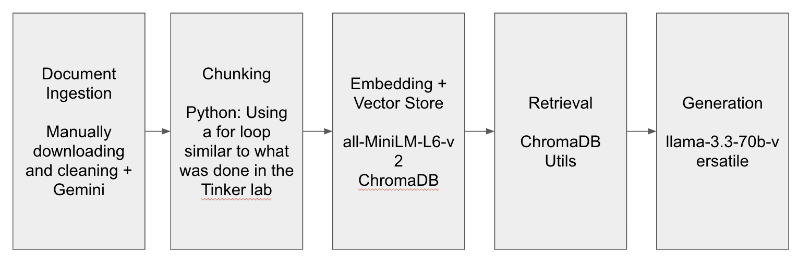

# Project 1 Planning: The Unofficial Guide

> Write this document before you write any pipeline code.
> Your spec and architecture diagram are what you'll use to direct AI tools (Claude, Copilot, etc.) to generate your implementation — the more specific they are, the more useful the generated code will be.
> Update the Retrieval Approach and Chunking Strategy sections if you change your approach during implementation.
> Update this file before starting any stretch features.

---

## Domain

The domain I have selected is Syllabi for Duke University CS Courses. These syllabi include information about the course’s learning objectives, prerequisites if any, grading policies, and any other course related policies. This knowledge may be difficult to find otherwise because each professor may choose to have their own personal site to host this, a GitHub page, or an official Duke site; this makes it difficult to aggregate and compare courses, especially when students consider multiple options before selecting a course to enroll in.

---

## Documents

<!-- List your specific sources: URLs, subreddit names, forum threads, or file descriptions.
     Aim for at least 10 sources that together cover different subtopics or perspectives within your domain. -->

| # | Source | Description | URL or location |
|---|--------|-------------|-----------------|
| 1 | CS201 | Syllabus for Duke CS201. | https://coursework.cs.duke.edu/201fall24/documentation/-/blob/main/syllabus.md |
| 2 | CS250 | Syllabus for Duke CS250. | https://people.ee.duke.edu/~sorin/ece250/ |
| 3 | CS310 | Syllabus for Duke CS310. | https://courses.cs.duke.edu/spring25/compsci310/syllabus.pdf |
| 4 | CS330 | Syllabus for Duke CS330. | https://courses.cs.duke.edu/compsci330/summer18/Syllabus.pdf |
| 5 | CS171 | Syllabus for Duke CS171. | https://sites.duke.edu/compsci171cnfa2025/syllabus/ |
| 6 | CS370 | Syllabus for Duke CS370. | https://sites.duke.edu/compsci_370d_001_sp24/ |
| 7 | CS216 | Syllabus for Duke CS216. | https://sites.duke.edu/compsci216sp2025/syllabus/ |
| 8 | CS116 | Syllabus for Duke CS116. | https://sites.duke.edu/compsci116fa2021/syllabus/ |
| 9 | CS230 | Syllabus for Duke CS230. | https://courses.cs.duke.edu/spring20/compsci230/ |
| 10 | CS101 | Syllabus for Duke CS101. | https://courses.cs.duke.edu/fall25/compsci101/info.php |

---

## Chunking Strategy

<!-- How will you split documents into chunks?
     State your chunk size (in tokens or characters), overlap size, and explain why those
     numbers fit the structure of your documents.
     A review-heavy corpus warrants different chunking than a long FAQ. -->

I will split these documents into chunks that are character-based. 

**Chunk size:**
500

**Overlap:**
150

**Reasoning:**
Chunk size of 500 will allow the chunks to express relevant sections of data. One tradeoff is it may not be able to accurately express, in one chunk, the various matricies that are present across the sources (grading policy charts, exam retake policies, etc.) without splitting the key rules across chunks. The overlap of 150 will ensure that roughly 2-3 sentences are overlapped across chunks. This will prevent rules that span the context of 2-3 sentences are captured without being split across chunks.

**Stretch feature — selectable chunking strategy:**
The chunker supports two strategies, chosen at runtime (default set by `CHUNK_STRATEGY` in config.py, overridable on the command line, e.g. `python embed_and_retrieve.py paragraph`):

- `character` — the fixed-size sliding window described above (CHUNK_SIZE / CHUNK_OVERLAP).
- `paragraph` — splits on blank lines and emits one chunk per paragraph with no size cap and no overlap. This respects the document's natural structure, so a rule written as a single paragraph stays intact rather than being split across a window boundary. The tradeoff is uneven chunk sizes (a one-line header and a long policy paragraph become equally-weighted chunks).

This lets us compare how chunk shape — not just chunk size — affects retrieval on the same corpus. Empirically, paragraph chunking produced richer answers on the "which courses allow AI?" question (it recovered CS101's specific LLM policy), but the stubborn failures (CS201 exam retakes, CS330 prerequisites) persisted under both strategies.

---

## Retrieval Approach

<!-- Which embedding model are you using (e.g., all-MiniLM-L6-v2 via sentence-transformers)?
     How many chunks will you retrieve per query (top-k)?
     If you were deploying this for real users and cost wasn't a constraint, what tradeoffs
     would you weigh in choosing a different embedding model — context length, multilingual
     support, accuracy on domain-specific text, latency? -->

**Embedding model:**
all-MiniLM-L6-v2 via sentence-transformers

**Top-k:**
10

(Updated during implementation from 6 to 10. With k=6, several questions retrieved no relevant chunk and the model correctly refused to answer. Bumping to 10 widened the candidate set enough to answer questions better, at the cost of slightly noisier context on simpler questions.)

**Production tradeoff reflection:**
I would look at models that are trained on domain-specific text. More sophisticated models would allow for greater semantic accuracy regarding what's being discussed in these syllabi.

---

## Evaluation Plan

<!-- List your 5 test questions with their expected correct answers.
     Questions should be specific enough that you can judge whether the system's response
     is right or wrong. "What are good dining halls?" is too vague.
     "What do students say about wait times at [dining hall name] during lunch?" is testable. -->

| # | Question | Expected answer |
|---|----------|-----------------|
| 1 | How is the final exam administered in CS230? | Online, take-home, open-book and open-notes. Released at 12:01am and due by 11:59pm Eastern, designed to take roughly 3 hours but untimed within the 24-hour window. |
| 2 | How much is Exam 3 worth in CS116? | 18% of the final grade. |
| 3 | How is CS216 structured? | Hybrid, Flipped, and Just-in-Time. Eeasier material is learned before class via readings, videos, and comprehension quizzes, and class time is spent actively engaging with the harder material. |
| 4 | What is the late submission penalty for projects in CS201? | Projects up to 24 hours late receive no penalty. After that a late submission loses 10% per day. |
| 5 | Should I take CS 201 before CS 101? | No. CS101 is a prerequisite for CS201. |

---

## Anticipated Challenges

<!-- What could go wrong? Name at least two specific risks with reasoning.
     Consider: noisy or inconsistent documents, missing source attribution, off-topic
     retrieval, chunks that split key information across boundaries. -->

1. The chunk size may not be large enough to house an entire table (ex. grading policy matrix). Those may be split across chunks.

2. Many of the syllabi include similar information but have key differences. When retrieving data, the embeddings may not persist sufficient information to distinguish which course's information is being read from.

---

## Architecture

<!-- Draw a diagram of your pipeline showing the five stages:
     Document Ingestion → Chunking → Embedding + Vector Store → Retrieval → Generation
     Label each stage with the tool or library you're using.
     You can use ASCII art, a Mermaid diagram, or embed a sketch as an image.
     You'll use this diagram as context when prompting AI tools to implement each stage. -->

---

## AI Tool Plan

<!-- For each part of the pipeline below, describe:
     - Which AI tool you plan to use (Claude, Copilot, ChatGPT, etc.)
     - What you'll give it as input (which sections of this planning.md, which requirements)
     - What you expect it to produce
     - How you'll verify the output matches your spec

     "I'll use AI to help me code" is not a plan.
     "I'll give Claude my Chunking Strategy section and ask it to implement chunk_text()
     with my specified chunk size and overlap" is a plan. -->

Document Ingestion: I plan to use manual effort + Gemini to clean my sources to make sure they are rid of random HTML tags, etc. I'll remove large portions of unwanted data myself and paste the remaining text to Gemini with my expectations of what should and should not be there and ask it to clean it. I expect it to produce text that I can copy into txt files.

Chunking: I plan to use Claude to help me write chunk_text(). I will give it my Chunking Strategy section above so it can pull the Chunk Size and Overlap Size. I will also describe what I want my desired result to look like from that function in terms of what needs to be stored. I expect it to produce the working code. I will verify it through printing out how many chunks were created per doc and ensure that the correct config values for chunk size and overlap are being used.

Embedding + Vector Store: I plan to use Claude to help me write embed_and_store(). I will provide it with the diagram above so it knows to use ChromaDB. I will print how many vectors were stored and use that to test.

Retrieval: I plan to use Claude to help me write retrieve(). I will provide it with the diagram above so it knows to use ChromaDB utils. I will print which chunks were retrieved to validate that it works, along with the cosine similarity. I will also validate that it used ChromaDB Utils to do the retrieval.

Generation: I plan to write the Grounding strategy myself and use Claude to help interact with the LLM to produce the final output text. I will provide a prompt and expect it to use that prompt in generating the response. I will validate that the response is appropriately grounded by looking for signs of not grounding (using data not present in the sources).

**Milestone 3 — Ingestion and chunking:**

**Milestone 4 — Embedding and retrieval:**

**Milestone 5 — Generation and interface:**

